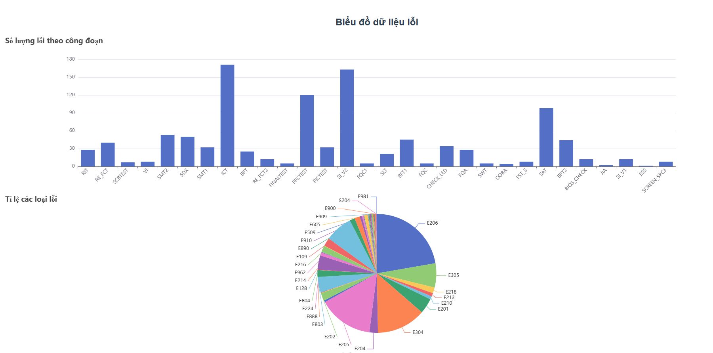

# my-project

## Project setup
```
npm install
```

### Compiles and hot-reloads for development
```
npm run serve
```

### Compiles and minifies for production
```
npm run build
```
https://github.com/TaosLezz/frontend-websocket-chart/blob/main/images/bieu_do.png
### Lints and fixes files
```
npm run lint
```
## Here are some results <a name = 'interface'></a>
```

```
### Customize configuration
See [Configuration Reference](https://cli.vuejs.org/config/).
